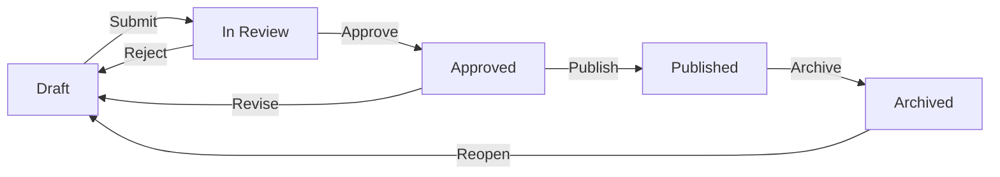

# How It Works All Contributors

Every article on PATHS goes through a structured review process before it reaches your audience. This ensures quality, accuracy, and consistency across all published content.

## The Editorial Workflow

Your article moves through a series of statuses — from first draft to published piece. Here's how the journey looks:

## Status Reference

| Status | What It Means | Who Can Move It Forward |
|--------|--------------|------------------------|
| **Draft** | Your article is being written. Only you and your editors can see it. | You (by submitting) |
| **In Review** | Your article is with an editor for review. | Editor (approve or reject) |
| **Approved** | Your article passed review and is ready to go live. | Publisher (publish) |
| **Published** | Your article is live — readers can see it. | Publisher (archive) |
| **Archived** | Your article has been taken offline. It can be reopened. | Publisher (reopen) |

!!! tip
    You'll always see your article's current status as a colored badge in the dashboard and in the editor.
