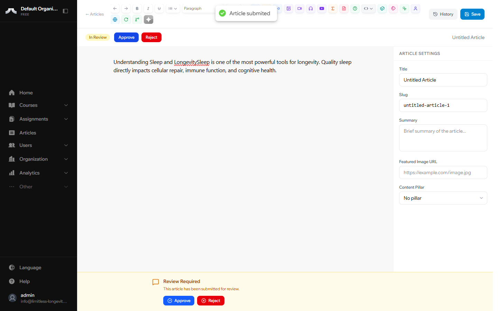
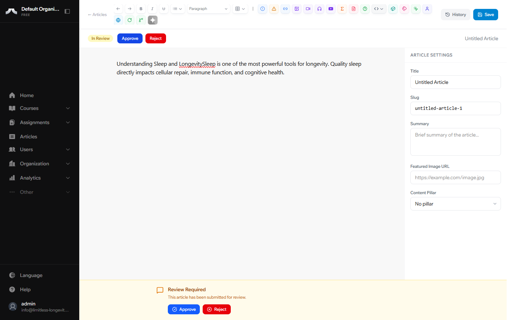

# Submitting for Review Authors

When your article is ready for a second pair of eyes, submit it for editorial review. An editor on the team will assess your work and either approve it or provide feedback.

## How to Submit

1. Open your article in the editor.
2. Make sure you're happy with the content — once submitted, you won't be able to edit until the review is complete.
3. Click **Submit for Review**.
4. Your article's status changes from **Draft** to **In Review**.

## What Happens Next

An editor on the team will review your work. You'll see the status update in your dashboard — no need to follow up manually. When the review is complete, the article will either move to **Approved** or return to **Draft** with feedback.

## If Your Article Is Sent Back

A rejection is not a negative judgment — it means the editor has specific feedback to help strengthen your piece. This is a normal and valuable part of the process.

**To find the feedback:**

1. Open the article from your dashboard.
2. Look for the editor's notes — they'll appear in the article's feedback area.

**To resubmit:**

1. Review the editor's notes carefully.
2. Make your changes in the editor.
3. Click **Submit for Review** again.

!!! tip
    Feedback is part of the collaborative process. Editors provide specific notes to help you create the strongest possible content. Think of it as a second pair of expert eyes.

---

## What's Next?

If you're an Editor or Publisher, learn how to review and publish articles in [Reviewing & Publishing](reviewing-and-publishing.md). Otherwise, check the [Glossary](../reference/glossary.md) and [FAQ](../reference/faq.md) for quick answers to common questions.
