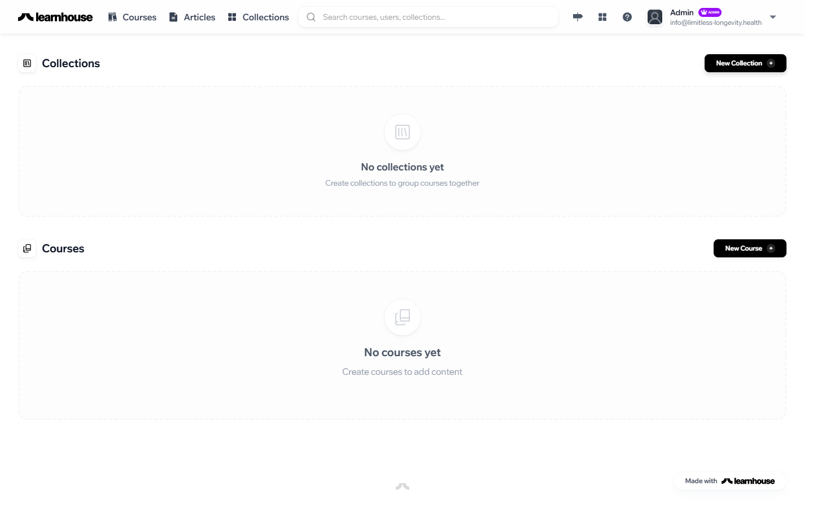

# Finding Your Way Around All Contributors

Here's a quick tour of the PATHS platform so you know where everything lives. Once you're familiar with these areas, you'll be ready to start creating content.

---

## Your Dashboard

After logging in, you'll land on your **Dashboard**. This is your home base — it shows your recent articles and gives you quick access to everything you need.

---

## Key Areas

There are three areas you'll use regularly:

### Sidebar Navigation

The left-hand sidebar is how you move around the platform. Click **Articles** to see all articles, or navigate to specific content pillars. The sidebar stays visible on every page.

### Main Content Area

The large central area is where you'll do your work — browsing articles, writing in the editor, or reviewing content. Whatever you select in the sidebar appears here.

### Profile Menu

Your initials appear in the **top-right corner**. Click them to access your profile settings or log out.

---

!!! info "Key Terms"
    A few terms you'll see throughout the platform:

    - **Dashboard** — Your home screen showing recent activity and quick links
    - **Organization** — The Limitless Longevity workspace that contains all content and team members
    - **Pillar** — A content category (e.g., "Nutrition," "Sleep," "Biomarkers") that groups related articles together
    - **Article** — A single piece of content — a guide, explainer, or deep-dive on a topic
    - **Draft** — An article that's still being written or revised, not yet visible to members

---

## What's Next?

You know the layout — now let's create your first article.

[Creating an Article →](../writing-articles/creating-an-article.md){ .md-button }
