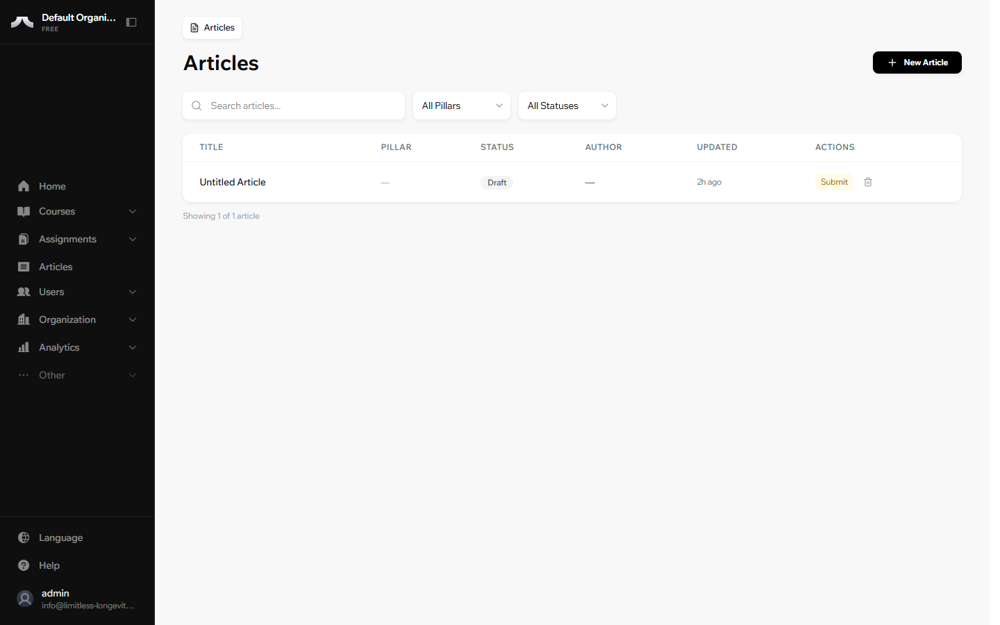
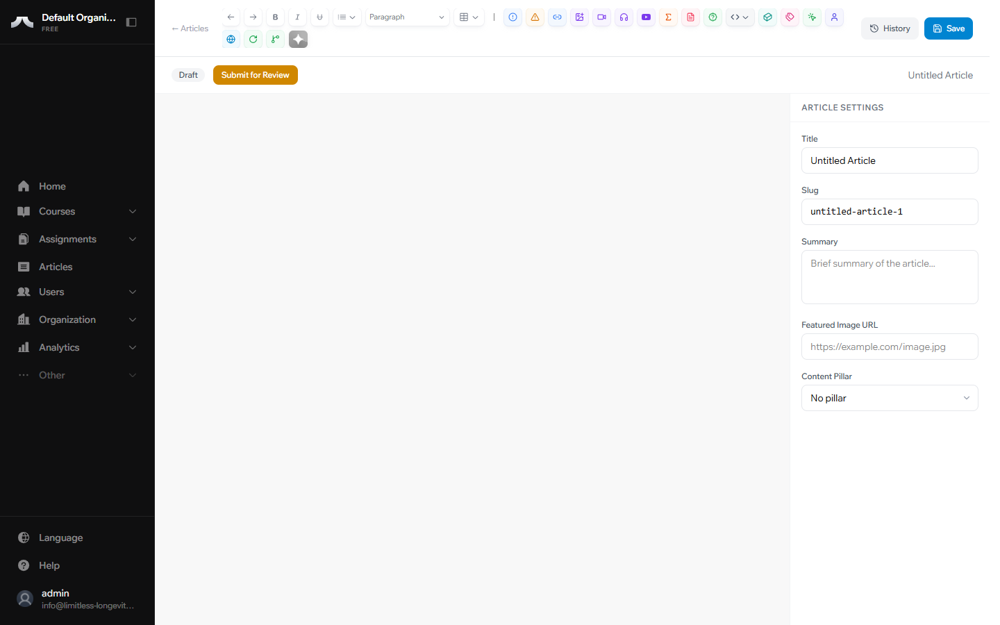

# Creating an Article All Contributors

Ready to share your expertise? Creating an article on PATHS takes less than a minute.

## Step by Step

**1. Open the Articles section**

From your Dashboard, click **Articles** in the left sidebar. You'll see a list of all articles you have access to.

**2. Click New Article**

Click the **New Article** button in the top right corner.

**3. Give your article a title**

The editor opens with a blank page. Type your article title at the top — this is what readers will see as your headline.

**4. Write your content**

Use the main editor area to write. You can format text, add images, and embed videos — we cover all of that in the next guide.

**5. Save your work**

Click **Save** when you're ready to preserve your progress.

!!! warning "Save early, save often"
    Your work auto-saves periodically, but clicking **Save** manually creates a version snapshot. If you ever need to go back to an earlier version, only manual saves appear in your Version History.

!!! tip "Try it now"
    Create a test article. Give it any title, write a sentence or two, and hit **Save**. You can always delete it later — this is the fastest way to get comfortable with the platform.

## What's Next?

Learn how to format your content, add images, and embed videos in [Using the Editor](using-the-editor.md).
