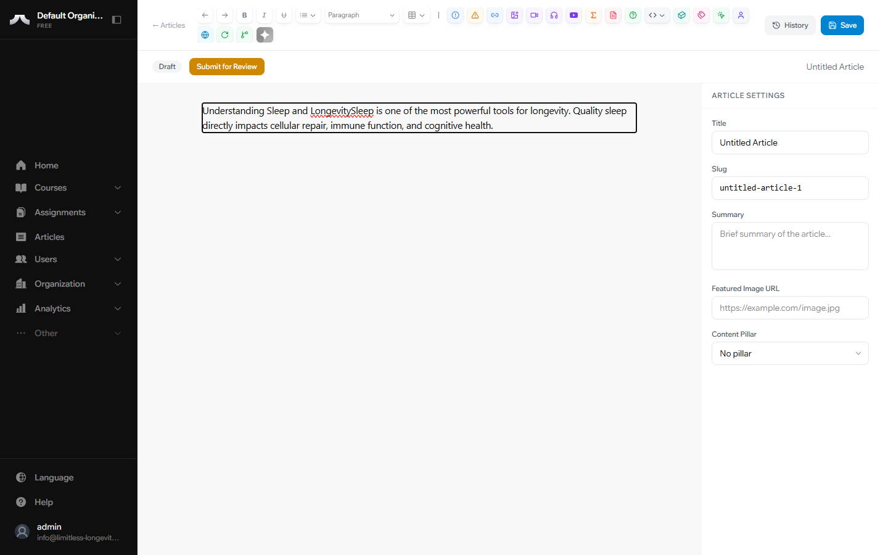
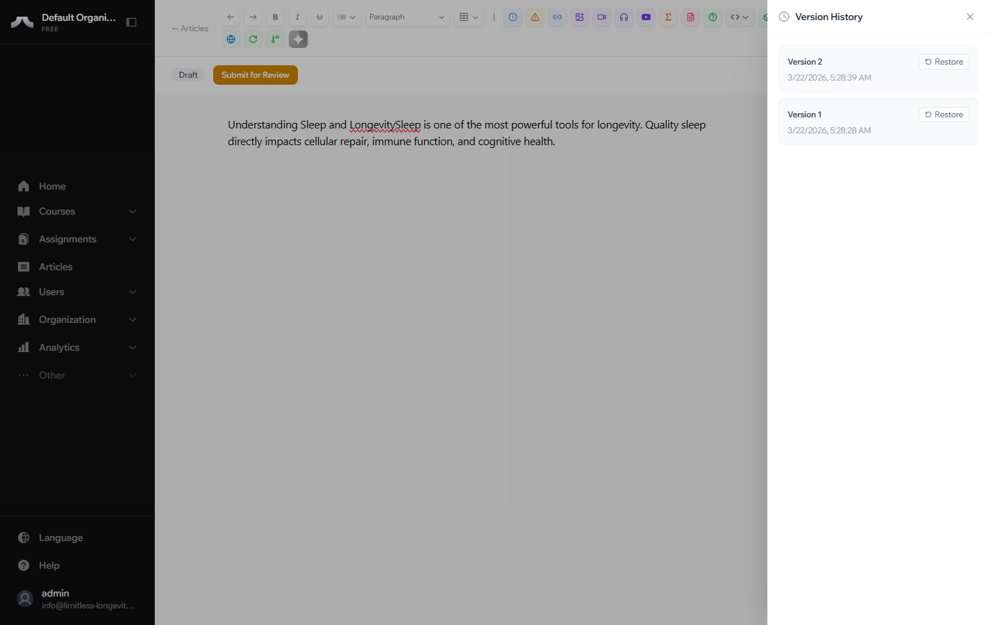

# Using the Editor All Contributors

The PATHS editor works similarly to Google Docs — what you see is what your readers will see. No code, no markup, just writing.

## Formatting Basics

The toolbar at the top of the editor gives you everything you need:

| Tool | What it does |
|------|-------------|
| **Bold** | Makes text **bold** for emphasis |
| *Italic* | Makes text *italic* for softer emphasis |
| Heading 1 | Main section heading (use sparingly — one per major section) |
| Heading 2 | Sub-section heading |
| Heading 3 | Minor heading within a sub-section |
| Bullet list | Unordered list for groups of related points |
| Numbered list | Ordered list for sequential steps |
| Link | Turns selected text into a clickable link |
| Blockquote | Indented text block for quotes or key takeaways |

## Adding Images

To add an image, place your cursor where you want the image to appear, then use the image tool in the toolbar. You can upload an image from your computer directly into the editor.

!!! info "Image tips"
    Use high-quality images with a minimum width of 800px. The editor will resize them to fit, but starting with a sharp image ensures the best result.

## Embedding Videos

To embed a YouTube video:

1. Copy the video URL from YouTube
2. Place your cursor where you want the video
3. Use the embed tool in the toolbar and paste the URL

The video will appear inline in your article, ready for readers to play.

## Callout Boxes

The editor supports **Info** and **Warning** callout boxes — highlighted panels that draw attention to important points. Use them to flag key takeaways, safety notes, or anything your readers should not miss.

## Tables

You can insert tables directly in the editor for presenting structured data such as dosage ranges, comparison charts, or schedules.

!!! tip "Prefer writing in Google Docs?"
    No problem — write your content there, then copy and paste it into the PATHS editor. Most formatting carries over automatically.

## Version History

Every time you click **Save**, the platform creates a version snapshot of your article. You can:

- View a list of all past versions
- Preview any previous version
- Restore a previous version if you need to undo changes

This gives you a safety net — experiment freely, knowing you can always go back.

## What's Next?

Before your article can be published, it needs metadata — a title, summary, image, and content pillar. Learn how in [Metadata & Pillars](metadata-and-pillars.md).
